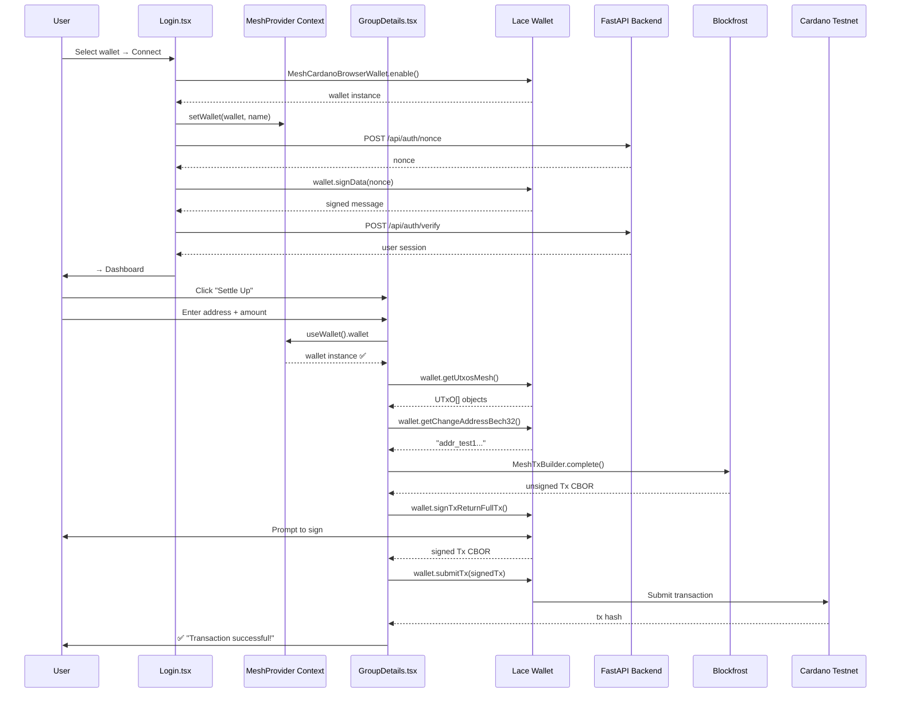

# Pull Request: Cardano Testnet Settle Up Transaction

## Overview

Implements a working "Settle Up" transaction flow that sends ADA from the user's Cardano wallet to any testnet address on the **Preview** network. Users can settle group expenses by sending tADA directly on-chain, with full transaction verification via Cardanoscan.

---

## What Changed

### Files Modified
| File | Change |
|------|--------|
| `frontend/src/pages/GroupDetails.tsx` | Rewrote transaction logic using official Mesh SDK v2 pattern |
| `frontend/src/pages/Login.tsx` | Added `setWallet()` call to register wallet in React context |
| `frontend/src/pages/Groups.tsx` | Removed unused `onNavigate` prop (TypeScript strict mode) |
| `backend/routes/auth.py` | Fixed `maybe_single()` → `None` handling for new users |
| `.gitignore` | Added `__pycache__/` and `venv/` entries |
| `artifacts/test.md` | Updated testing guide |
| `AGENTS.md` | Created agent instruction file |

### Key Architecture Decision: MeshTxBuilder vs Transaction

The original code used the deprecated `Transaction` class from `@meshsdk/transaction`:

```typescript
// ❌ Old (broken)
import { Transaction } from "@meshsdk/transaction";
const tx = new Transaction({ initiator: wallet as any });
tx.sendLovelace(address, lovelace);
const unsignedTx = await tx.build();
```

The new code uses `MeshTxBuilder` from `@meshsdk/core`:

```typescript
// ✅ New (working)
import { MeshTxBuilder } from "@meshsdk/core";
const txBuilder = new MeshTxBuilder({ fetcher: provider });
const utxos = await wallet.getUtxosMesh();
const unsignedTx = await txBuilder
  .txOut(address, [{ unit: "lovelace", quantity: lovelace }])
  .changeAddress(await wallet.getChangeAddressBech32())
  .selectUtxosFrom(utxos)
  .complete();
const signedTx = await wallet.signTxReturnFullTx(unsignedTx, false);
const txHash = await wallet.submitTx(signedTx);
```

---

## Errors Encountered & Root Cause Analysis

This section documents every error in the order we hit them, explains *why* each occurred, and how it was fixed. This serves as both a postmortem and a teaching reference for future Cardano dApp development.

---

### Error 1: ModuleNotFoundError — Supabase Not Installed

```
ModuleNotFoundError: No module named 'supabase'
```

**What happened:** The backend imports `supabase` in `database.py` at module level. This runs on server startup. If the Python environment doesn't have the package installed, the server crashes immediately.

**Root cause:** `pip install -r requirements.txt` was never run in the backend directory.

**Fix:** Run `pip install -r requirements.txt` inside the backend folder.

**Lesson for future:** Always check `requirements.txt` has been installed in the active Python environment before running any server.

---

### Error 2: externally-managed-environment (PEP 668)

```
error: externally-managed-environment
This environment is externally managed
╰─> To install Python packages system-wide, try apt install python3-xyz
```

**What happened:** Ubuntu/Debian protects the system Python from direct `pip install`. This is a security feature from [PEP 668](https://peps.python.org/pep-0668/) to prevent pip from conflicting with OS-managed packages.

**Root cause:** Running `pip install` using the system Python (`/usr/bin/python3`) without a virtual environment.

**Fix:** Create a virtual environment:
```bash
python3 -m venv venv
source venv/bin/activate
pip install -r requirements.txt
```

**Lesson for future:** Always use a Python virtual environment for project dependencies. The repo `.gitignore` now includes `venv/` to prevent the 10,000+ files from being tracked.

---

### Error 3: Supabase Column Missing — `wallet_address`

```
postgrest.exceptions.APIError: column users.wallet_address does not exist
```

**What happened:** The backend `auth.py` tried to query `supabase.table("users").select("*").eq("wallet_address", wallet)`, but the Supabase `users` table had no `wallet_address` column.

**Root cause:** The Supabase database schema was not set up to match the backend code. The backend expected `users.wallet_address` but the actual schema used `users.stake_address` (introduced in a later commit).

**Fix:** A subsequent pull from `main` brought in the updated schema that uses `stake_address` and a proper nonce-based authentication flow.

**Lesson for future:** Database schemas must be synced between Supabase and backend code. When adding a new column to code, ensure the Supabase table has it too (or write a migration).

---

### Error 4: PGRST116 — `.single()` Crashes on Zero Rows

```
postgrest.exceptions.APIError: Cannot coerce the result to a single JSON object
code: PGRST116, details: The result contains 0 rows
```

**What happened:** The `request_nonce` endpoint queried for a user by `stake_address` using `.single()`. When a brand new user (never logged in before) hits this endpoint, the query returns **zero rows**. PostgREST's `.single()` method **throws an error** when there are 0 rows — it expects exactly 1 row.

**Root cause:**
```python
# ❌ Broken — .single() throws PGRST116 when user doesn't exist
user_res = supabase.table("users") \
    .select("id") \
    .eq("stake_address", stake_address) \
    .single() \
    .execute()

if not user_res.data:  # ← This line NEVER runs because .single() already threw
    # insert new user...
```

The code had a `if not user_res.data:` guard, but `.single()` throws **before** returning, so the guard never executes.

**Fix:**
```python
# ✅ Working — .maybe_single() returns None instead of throwing
existing = supabase.table("users") \
    .select("id") \
    .eq("stake_address", stake_address) \
    .maybe_single() \
    .execute()

if existing is None:  # ← Now correctly catches new users
    # insert new user...
```

Wait — `.maybe_single()` returns `None` (not a response object with `.data`), so the check must be `if existing is None`, NOT `if not existing.data`.

> **Teaching point:** `maybe_single()` returns the raw row or `None`, while `.single()` returns a response object or throws. This is a critical PostgREST distinction.

**Lesson for future:** Always use `.maybe_single()` when the row might not exist. Only use `.single()` when you're certain the row exists (e.g., after a successful insert).

---

### Error 5: CORS Policy — Browser Blocks Error Response

```
Access to fetch at 'http://localhost:8000/api/auth/login' has been blocked by CORS policy:
No 'Access-Control-Allow-Origin' header is present on the requested resource.
```

**What happened:** The browser showed a CORS error, making it look like a CORS configuration issue. But the backend log showed:
```
POST /api/auth/login HTTP/1.1 500 Internal Server Error
```

**Root cause:** When the backend crashes with a 500 error, FastAPI's CORS middleware may **not attach** the `Access-Control-Allow-Origin` header to the error response. The browser then sees a response without CORS headers and blocks it, reporting a CORS policy error.

**The real error was the 500**, not CORS. The browser's CORS error was a **symptom**, not the disease.

**Fix:** Fix the underlying 500 (Error 3 above — the missing database column).

**Lesson for future:** When you see a CORS error with a local backend, always check the backend terminal for the real error. The 500 crash prevents CORS headers from being attached.

---

### Error 6: "Please connect your wallet first"

**What happened:** After successful login, clicking "Settle Up" showed "Please connect your wallet first" even though the wallet was used for authentication.

**Root cause:** Two separate wallet states exist:

1. **Local wallet instance** — Created in `Login.tsx` via `MeshCardanoBrowserWallet.enable()`. Used for nonce signing during login. Lives in the component's local scope.
2. **React context wallet** — Managed by `MeshProvider` / `useWallet()`. Available to all components. Initial state is an empty object `{}`.

When `Login.tsx` called `enable()`, it got a working wallet instance but **never registered it** with the `MeshProvider` context. So when `GroupDetails.tsx` called `useWallet().wallet`, it got `{}` — the default empty object.

```typescript
// Login.tsx — wallet created but NOT stored in context
const wallet = await MeshCardanoBrowserWallet.enable(selectedWallet);
onLogin(user);  // ← user saved, wallet lost

// GroupDetails.tsx — gets empty object from context
const { wallet } = useWallet();  // wallet === {} (empty object)
```

**Fix:** Call `setWallet()` after enabling:
```typescript
const { setWallet } = useWallet();

const wallet = await MeshCardanoBrowserWallet.enable(selectedWallet);
setWallet(wallet, selectedWallet);  // ← Store in global context
```

**Lesson for future:** When using `@meshsdk/react`'s `MeshProvider`, always call `setWallet()` after `enable()` so the wallet is available component-wide via `useWallet()`.

---

### Error 7: `getChangeAddressBech32 / getChangeAddress is not a function`

**What happened:** Same root cause as Error 6. The `wallet` object was `{}` (empty), so none of its methods existed.

```
TypeError: wallet.getChangeAddressBech32 is not a function
TypeError: wallet.getChangeAddress is not a function
```

**Fix:** Same as Error 6 — call `setWallet()` in `Login.tsx`.

---

### Error 8: `getUtxos is not a function` / CIP-30 CBOR Hex Mismatch

```
Error: [Transaction] An error occurred during build:
TypeError: this.initiator.getUtxos is not a function
```

```
TypeError: Cannot read properties of undefined (reading 'address')
```

**What happened:** This is the deepest and most instructive bug. It's a **version mismatch** between two Mesh SDK concepts:

| Method | Returns | Used by |
|--------|---------|---------|
| `wallet.getUtxos()` (CIP-30 raw) | `string[]` — CBOR hex strings | `Transaction` (v1, deprecated) |
| `wallet.getUtxosMesh()` (Mesh convenience) | `UTxO[]` — structured objects | `MeshTxBuilder` (v2, recommended) |

The old `Transaction` class calls `this.initiator.getUtxos()` expecting structured `UTxO[]` objects (with `.output.amount`, `.output.address` fields). But:

1. In Mesh SDK v2, `getUtxos()` is a CIP-30 passthrough that returns raw **CBOR hex strings**
2. CBOR hex strings don't have `.address` or `.output.amount` properties
3. So the transaction builder tries `utxo.output.address` on a string → **"Cannot read properties of undefined (reading 'address')"**

**Why `Transaction` is deprecated:** The `@meshsdk/transaction` README explicitly says:
> `Transaction` class is on planning for V2. Use `MeshTxBuilder` instead for tx-building for now.

**Fix:** Use `MeshTxBuilder` with `.selectUtxosFrom(utxos)` where `utxos` comes from `wallet.getUtxosMesh()`:
```typescript
const utxos = await wallet.getUtxosMesh();
txBuilder.selectUtxosFrom(utxos);
```

This feeds properly-structured `UTxO[]` objects directly to the builder, avoiding the CIP-30 passthrough entirely.

**Lesson for future:** In Mesh SDK v2, always distinguish between:
- **CIP-30 base methods** (`getUtxos()`, `getChangeAddress()`) — return **raw hex/CBOR**, used by wallet internals
- **Mesh convenience methods** (`getUtxosMesh()`, `getChangeAddressBech32()`) — return **parsed/formatted** data, used in application code

Never pass raw CIP-30 results to transaction builders.

---

### Error 9: Invalid Address Format — Hex vs Bech32

```
Error serializing outputs: Invalid address format,
003f9ddee5522b034eace53906ad94839d22557646e4d30b68debd482c61d61e20da...
```

**What happened:** `wallet.getChangeAddress()` returns the address in **hex format** (`003f9dde...`), but the transaction serializer expects **bech32 format** (`addr_test1...`).

**Root cause:** In Mesh SDK v2, `getChangeAddress()` is the CIP-30 passthrough that returns hex. The convenience method `getChangeAddressBech32()` returns the human-friendly bech32 format.

```
wallet.getChangeAddress()      → "003f9dde..."        (hex)
wallet.getChangeAddressBech32() → "addr_test1qz..."   (bech32)
```

The transaction serializer needs bech32.

**Fix:** Use `wallet.getChangeAddressBech32()` instead of `wallet.getChangeAddress()`.

**Lesson for future:** Always use the `*Bech32` variant of wallet methods when interacting with transaction builders or APIs that expect human-readable addresses.

---

### Error 10: Wallet Locked

```
APIError: Wallet is locked. Please unlock the wallet first.
```

**What happened:** Lace (the browser wallet) auto-locks after a period of inactivity. The transaction signing API requires an unlocked wallet.

**Fix:** Open the Lace extension and enter your password to unlock it before signing.

**This is actually good news** — it means the code reached the wallet successfully.

---

## Final Working Transaction Flow



---

## Key Takeaways

1. **`MeshTxBuilder` > `Transaction`** — The `Transaction` class is deprecated. Always use `MeshTxBuilder` with `.selectUtxosFrom()`, `.changeAddress()`, and `.complete()`.

2. **CIP-30 raw vs Mesh convenience** — Wallet methods come in pairs. Use the `*Bech32` / `*Mesh` variants in application code. The raw CIP-30 methods return hex/CBOR that transaction builders can't consume directly.

3. **React context vs local scope** — `MeshCardanoBrowserWallet.enable()` creates a local wallet. Call `setWallet()` to make it available via `useWallet()` across components.

4. **PostgREST `.maybe_single()`** — Always use `.maybe_single()` when the row might not exist. `.single()` throws `PGRST116` on zero rows.

5. **Virtual environments** — Always use `venv` for Python projects. System Python on modern Linux blocks direct `pip install`.

6. **CORS 500 masking** — A CORS error in the browser console often means the backend crashed. Always check the backend terminal first.

---

## How to Test

See `artifacts/test.md` for the step-by-step testing guide.
