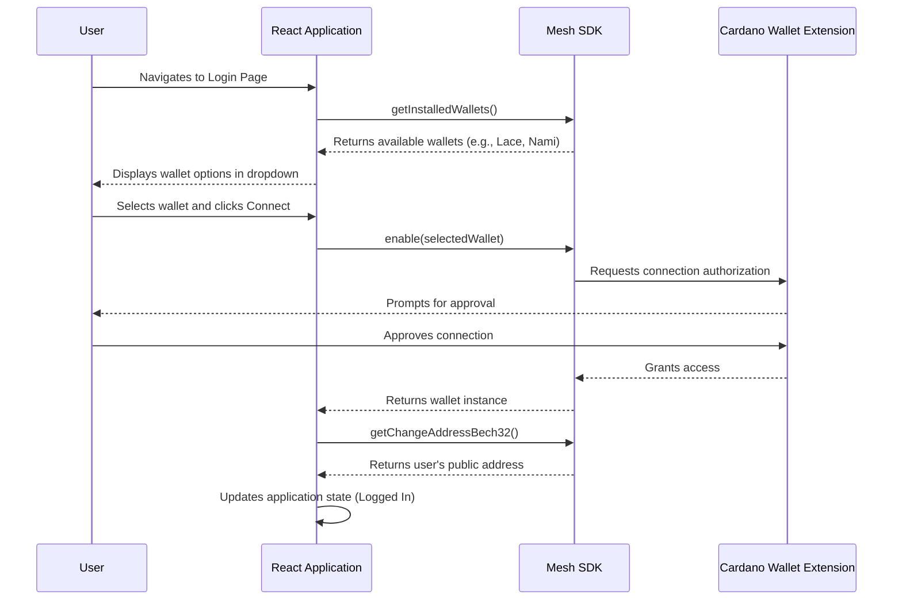
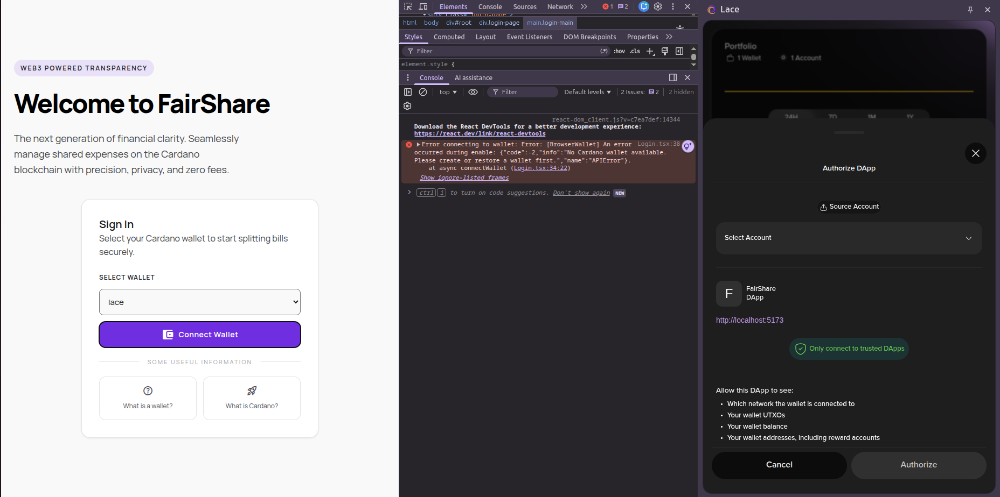

# Pull Request: Implement Cardano Wallet Integration using Mesh SDK

## Overview
This pull request transitions the application from a mock login interface to a fully functional Web3 authentication system. We integrated the Mesh SDK to allow users to securely connect their Cardano browser wallets (such as Lace, Nami, or Eternl) to the decentralized application.

## Technical Changes

### 1. Wallet Connection Logic (Login.tsx)
The primary updates were made to the authentication component. We removed the previous text-based mock login and implemented a wallet detection and connection flow.

*   **Wallet Detection:** We utilized `MeshCardanoBrowserWallet.getInstalledWallets()` to automatically scan the user's browser environment for CIP-30 compatible Cardano wallets.

    ```typescript
    useEffect(() => {
      const getAvailableWallets = async () => {
        const wallets = await MeshCardanoBrowserWallet.getInstalledWallets();
        const walletNames = wallets.map((w) => w.name);
        setAvailableWallets(walletNames);
      };
      getAvailableWallets();
    }, []);
    ```
    *Reason for inclusion:* This logic is necessary to dynamically discover which Cardano wallets the user has installed (e.g., Lace, Nami), as hardcoding wallet names would be inflexible and prone to errors if users prefer different extensions.

*   **Connection Initialization & Address Retrieval:** Upon selection, the application calls `MeshCardanoBrowserWallet.enable()` to prompt the extension for connection approval. Once authorized, we fetch the user's primary public address using `getChangeAddressBech32()`. 

    ```typescript
    const connectWallet = async (e: React.FormEvent) => {
      e.preventDefault();
      try {
        if (selectedWallet === "Disconnected") {
          alert("Please select a wallet first!");
          return;
        }
        
        const wallet = await MeshCardanoBrowserWallet.enable(selectedWallet);
        const address = await wallet.getChangeAddressBech32();
        onLogin(address);
      } catch (error) {
        console.error("Error connecting to wallet:", error);
      }
    };
    ```
    *Reason for inclusion:* This block replaces the mock text input login. It securely delegates authentication to the user's actual browser wallet, ensuring that only users who cryptographically prove ownership of their Cardano addresses can access the application. The retrieved `address` is then used as the universal identifier for the user session.

### 2. Build Configuration Updates (vite.config.ts & package.json)
Integrating Web3 libraries into a modern Vite frontend presented a standard build challenge. Core blockchain dependencies (such as those handling large integer cryptography via `json-bigint`) rely heavily on built-in Node.js modules like `events`, `util`, and the `process` global variable. Vite v5 does not polyfill these by default for the browser.

*   **Polyfill Installation:** We installed `vite-plugin-node-polyfills` as a development dependency.
*   **Vite Configuration:** We updated `vite.config.ts` to include `nodePolyfills()` in the plugin array. 

    ```typescript
    import { defineConfig } from 'vite'
    import react from '@vitejs/plugin-react'
    import wasm from "vite-plugin-wasm";
    import topLevelAwait from "vite-plugin-top-level-await";
    import { nodePolyfills } from 'vite-plugin-node-polyfills'

    export default defineConfig({
      plugins: [
        react(),
        wasm(),
        topLevelAwait(),
        nodePolyfills() // Injected polyfills for Node.js modules
      ],
      define: {
        global: 'globalThis',
      },
    })
    ```
    *Reason for inclusion:* Modern bundlers like Vite do not include Node.js polyfills (like `events`, `util`, `process`) out of the box to keep frontend bundles small. However, the `@meshsdk` and its dependencies (specifically `json-bigint` used for handling large blockchain integers) were originally designed with Node.js environments in mind. Adding this plugin bridges the gap, allowing Node-centric cryptography and parsing libraries to execute flawlessly within the browser environment without throwing module resolution errors.

## Architecture Diagram

The following diagram illustrates the updated authentication flow between the application, the Mesh SDK, and the browser extension.



## Testing Steps
1. Start the development server using `npm run dev`.
2. Navigate to the local host address.
3. Verify that the login page displays a dropdown of installed Cardano wallets.
4. Select a wallet (such as Lace) and click the connect button.
5. Confirm that the wallet extension prompts for connection approval.
6. Upon approval, verify that the application successfully transitions to the authenticated state without any browser console errors regarding missing Node polyfills.


## Reference

